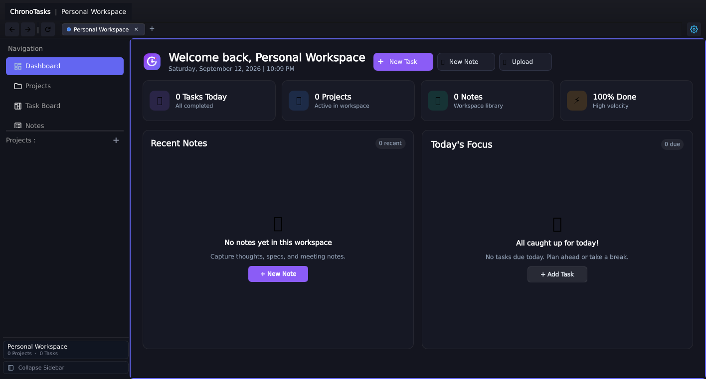
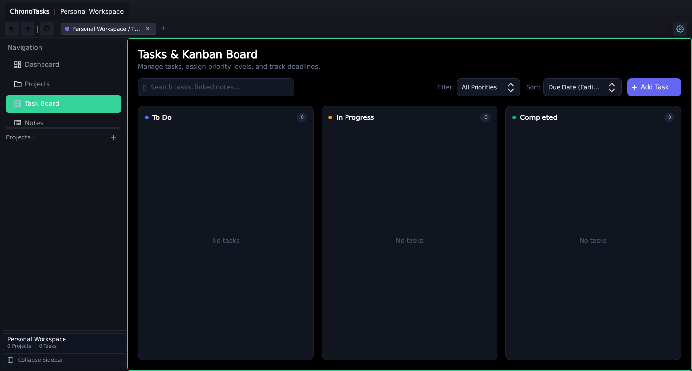
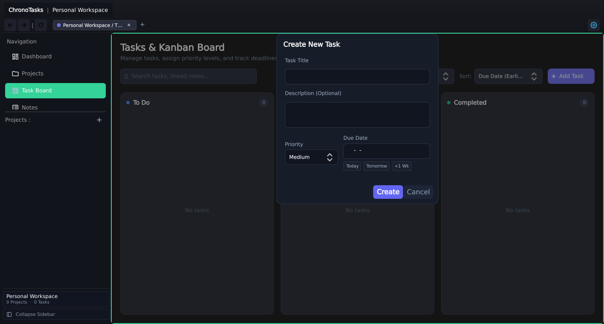
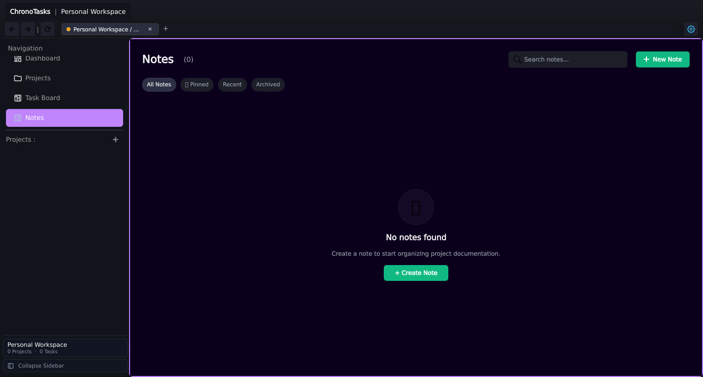
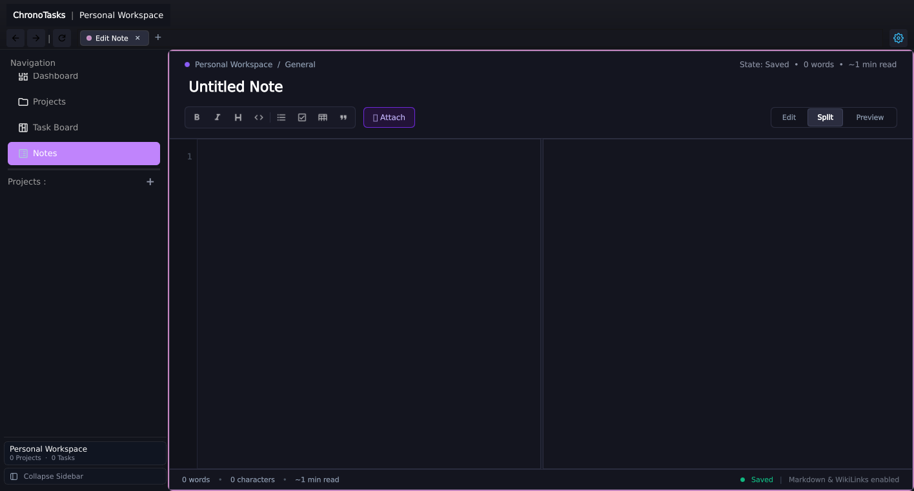
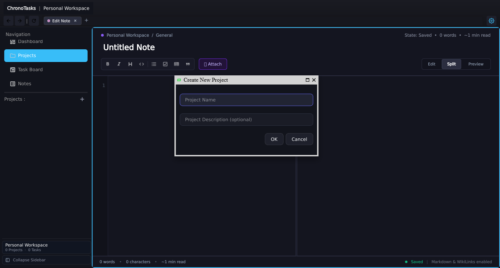

# ChronoTasks (TaskHelper) – Application Walkthrough & User Guide

Welcome to **ChronoTasks** (TaskHelper), a high-performance, dark-themed personal productivity and workspace management application built in modern **C++20** and **Qt 6 / QML**, capable of running natively as a desktop application and in modern web browsers via **Qt for WebAssembly (WASM)**.

This guide walks you through how to spin up the WebAssembly version of ChronoTasks, explores the core architecture, and provides a step-by-step visual walkthrough of the key features and user workflows.

---

## Table of Contents

1. [Architecture & Technology Stack](#architecture--technology-stack)
2. [Spinning Up the WebAssembly Application](#spinning-up-the-webassembly-application)
   - [Prerequisites](#prerequisites)
   - [Building the WebAssembly Binary](#building-the-webassembly-binary)
   - [Launching the Local COOP/COEP HTTP Server](#launching-the-local-coopcoep-http-server)
3. [Step-by-Step User Flow Walkthrough](#step-by-step-user-flow-walkthrough)
   - [Step 1: Workspace Dashboard (Home)](#step-1-workspace-dashboard-home)
   - [Step 2: Kanban Task Board](#step-2-kanban-task-board)
   - [Step 3: Creating and Managing Tasks](#step-3-creating-and-managing-tasks)
   - [Step 4: Notes and Documentation Hub](#step-4-notes-and-documentation-hub)
   - [Step 5: Markdown Note Editor & Split-View Preview](#step-5-markdown-note-editor--split-view-preview)
   - [Step 6: Project Management & Context Scoping](#step-6-project-management--context-scoping)
4. [Keyboard Shortcuts & Tips](#keyboard-shortcuts--tips)

---

## Architecture & Technology Stack

ChronoTasks is architected around clean decoupling between UI presentation, domain business logic, and persistence:

- **Core Language**: C++20 with modern RAII, standard algorithms, and Qt smart pointers.
- **UI Framework**: Qt 6.11 (Widgets + Qt Quick / QML 2.15). Heavy custom UI elements, smooth animations, and reactive property bindings.
- **WebAssembly Runtime**: Emscripten (`emcc 4.0.7`) with pthread multithreading (`wasm_multithread`) and dynamic memory growth (`-sALLOW_MEMORY_GROWTH=1`).
- **Markdown Engine**: MD4C high-performance Markdown parser embedded with custom ChronoTasks dark-mode CSS styling and task-list checkbox rendering.
- **Data Layer**: SQLite repository pattern (`WorkspaceRepository`, `TaskManager`, `NoteManager`, `ProjectManager`).

```
+-------------------------------------------------------------+
|                      ChronoTasks UI                         |
|  +---------------------+  +-------------------------------+  |
|  |     SideBar (Qt)    |  |     MainContentView (QML)     |  |
|  |  - Core Navigation  |  |  - Dashboard View (QML)       |  |
|  |  - Project Section  |  |  - Kanban Task Board (QML)    |  |
|  |  - Workspace Menu   |  |  - Note Editor & Preview (QML)|  |
|  +---------------------+  +-------------------------------+  |
+-------------------------------------------------------------+
                               |
                               v
+-------------------------------------------------------------+
|                     Domain Managers                         |
|    TaskManager  |  NoteManager  |  AppStateController       |
+-------------------------------------------------------------+
                               |
                               v
+-------------------------------------------------------------+
|               Data Layer & Native Utilities                 |
|   WorkspaceRepository  |  SQLite  |  MD4C Markdown Parser   |
+-------------------------------------------------------------+
```

---

## Spinning Up the WebAssembly Application

### Prerequisites

To compile and execute ChronoTasks in WebAssembly mode, you need:

1. **Qt 6 for WebAssembly**: Qt 6.8+ or 6.11.0 multithreaded build (`wasm_multithread`).
2. **Emscripten SDK**: `emsdk` version matching the Qt build (e.g., Emscripten 4.0.7).
3. **Build Tools**: CMake 3.22+ and Ninja build system.
4. **Python 3**: For running the local COOP/COEP HTTP development server.

### Building the WebAssembly Binary

From the project root directory, activate your Emscripten environment and configure CMake:

```powershell
# 1. Activate Emscripten SDK environment
C:\emsdk\emsdk_env.bat

# 2. Configure CMake targeting Qt WebAssembly
emcmake cmake -B build-wasm -G Ninja `
  -DCMAKE_TOOLCHAIN_FILE=C:/Qt/6.11.0/wasm_multithread/lib/cmake/Qt6/qt.toolchain.cmake `
  -DQT_HOST_PATH=C:/Qt/6.11.0/mingw_64 `
  -DCMAKE_BUILD_TYPE=Release

# 3. Compile the taskHelper WebAssembly target
cmake --build build-wasm --target taskHelper --config Release
```

Once compilation finishes, the build directory (`build-wasm/`) contains:
- `taskHelper.wasm` – The compiled application WebAssembly binary.
- `taskHelper.js` – The Emscripten runtime bootstrap glue code.
- `taskHelper.html` – The HTML5 canvas entry shell with Qt loader.
- `qtloader.js` – The Qt WebAssembly lifecycle orchestrator.

### Launching the Local COOP/COEP HTTP Server

Modern multi-threaded WebAssembly requires `SharedArrayBuffer` support in browsers. For security reasons, browsers enforce **Cross-Origin Opener Policy (COOP)** and **Cross-Origin Embedder Policy (COEP)** headers before unlocking `SharedArrayBuffer`.

The included [`serve_wasm.py`](file:///D:/Projects/C-C++%20Projects/Taskhelper2/serve_wasm.py) script automatically injects these necessary security headers:

```powershell
# Launch the server on port 9090 serving build-wasm
python serve_wasm.py 9090 build-wasm 127.0.0.1
```

Once running, navigate to:
```text
http://127.0.0.1:9090/taskHelper.html
```

---

## Step-by-Step User Flow Walkthrough

### Step 1: Workspace Dashboard (Home)

When launching ChronoTasks, you arrive at the **Workspace Dashboard**. This serves as the command center for your current workspace, aggregating key performance indicators, task deadlines, and note metrics.



#### Key Highlights:
- **Workspace Navigation (Left Sidebar)**:
  - Quick-switch between **Dashboard**, **Projects**, **Task Board**, and **Notes**.
  - Direct project selector showing active projects with color-coded badges.
  - Collapsible sidebar mode for distraction-free workflows.
- **Top Metrics Overview Cards**:
  - **Total Tasks**: Displays active, in-progress, and finished task metrics.
  - **Task Status Breakdown**: Live visual progress indicators for completed vs. pending tasks.
  - **Workspace Notes**: Quick count of documentation and markdown assets.
  - **Active Projects**: Overview of current deliverables.
- **Recent Activity Feed**: Real-time log of recent modifications, edits, and newly completed milestones.

---

### Step 2: Kanban Task Board

Click on **Task Board** in the sidebar to transition into the interactive Kanban Board. The board groups your work into status columns designed for agile task tracking.



#### Key Features:
- **Three-Column Workflow**:
  - **To Do**: Backlog of upcoming items waiting to be started.
  - **In Progress**: Tasks actively being worked on.
  - **Completed**: Finished tasks with completion timestamps.
- **Priority Tags**: Tasks are color-coded by urgency: `Critical` (Red), `High` (Orange), `Medium` (Blue), and `Low` (Gray).
- **Search & Filter Bar**:
  - Search query box for instant text filtering across task titles and descriptions.
  - Priority filter dropdown to focus on critical-path items.
  - Sort modes: Due Date (Earliest), Priority, Title (A-Z), or Newest Created.
- **Quick Status Transitions**: Interactive buttons on each task card allow one-click status transitions.

---

### Step 3: Creating and Managing Tasks

Click the **`+ Add Task`** button in the upper right corner of the Task Board to open the task creation dialog.



#### How to Use:
1. **Task Title**: Enter a concise summary of the deliverable (e.g., `"Review project specifications"`).
2. **Description**: Add contextual notes, acceptance criteria, or links.
3. **Priority Selection**: Choose between **Low**, **Medium**, **High**, or **Critical**.
4. **Due Date with Quick Chips**:
   - Type a custom target date (`YYYY-MM-DD`).
   - Or click one of the quick chips: **Today**, **Tomorrow**, or **+1 Wk** to automatically compute the due date.
5. Click **Create** to instantly populate the task into the **To Do** column.

---

### Step 4: Notes and Documentation Hub

Selecting **Notes** from the navigation sidebar opens the workspace documentation catalog. ChronoTasks provides a card-based repository for storing project notes, engineering documentation, meeting agendas, and wikis.



#### Key Capabilities:
- **Card Grid Layout**: Visual overview displaying note titles, auto-generated snippet previews, project associations, and word counts.
- **Filtering & Organization**:
  - Filter pills for **All Notes**, **Pinned**, and **Recent**.
  - Dedicated search bar with real-time text matching against note titles and content.
- **Pinning & Quick Actions**: Hover over any card to pin critical notes to the top or delete obsolete entries.
- **`+ New Note`**: Single-click creation of a new Markdown document.

---

### Step 5: Markdown Note Editor & Split-View Preview

Clicking **`+ New Note`** or selecting an existing note card transitions into the full-featured **Markdown Note Editor**.



#### Editor Capabilities:
- **Split-View Mode**: Simultaneous side-by-side editing:
  - **Left Pane**: Raw Markdown editor with syntax support.
  - **Right Pane**: MD4C-rendered live HTML preview styled with ChronoTasks dark-mode theme.
- **Formatting Toolbar**: Quick-insertion buttons for:
  - **Bold** (`**text**`), **Italic** (`*text*`), and **Strikethrough** (`~~text~~`).
  - **Headings** (`#`, `##`, `###`).
  - **Code Blocks** (```` ``` ````) and Inline Code (``` `code` ```).
  - **Task Lists / Checkboxes** (`- [ ] task item`).
  - **Blockquotes** (`> Quote text`) and **Tables**.
- **WikiLinks & Mentions**: Use `[[Target Note Title]]` to create bi-directional inter-note hyperlinks.
- **File Attachments**: Embed attachments seamlessly using `![[filename.ext]]` syntax.
- **Live Footer Metrics**: Real-time word count, character count, estimated reading time, and auto-save state confirmation (`State: Saved`).

---

### Step 6: Project Management & Context Scoping

Clicking **Projects** in the navigation sidebar or selecting an individual project from the sidebar's Projects section focuses your workspace on that specific project.



#### Project Scoping Features:
- **Isolated Context**: Scopes the Task Board and Notes catalog to display only items belonging to the selected project.
- **Project Color Coding**: Each project is assigned a distinct color palette, reflected across project badges on task cards and note chips.
- **Quick Project Creation**: Use the **`+`** icon next to the "Projects" heading in the sidebar to create new projects and define custom scopes.

---

## Keyboard Shortcuts & Tips

| Action | Shortcut / Trigger |
| :--- | :--- |
| **Search Notes / Tasks** | Click into Search Input or press Tab |
| **Close Open Dialogs** | <kbd>Escape</kbd> |
| **Collapse / Expand Sidebar** | Click **Collapse Sidebar** at the bottom of the sidebar |
| **Bold Selection (Editor)** | <kbd>Ctrl</kbd> + <kbd>B</kbd> |
| **Italic Selection (Editor)** | <kbd>Ctrl</kbd> + <kbd>I</kbd> |
| **Inline Code (Editor)** | <kbd>Ctrl</kbd> + <kbd>K</kbd> |
| **Internal Link (Editor)** | Type `[[` followed by the note title |

---

*ChronoTasks (TaskHelper) – Crafted with C++20, Qt6, and WebAssembly.*
